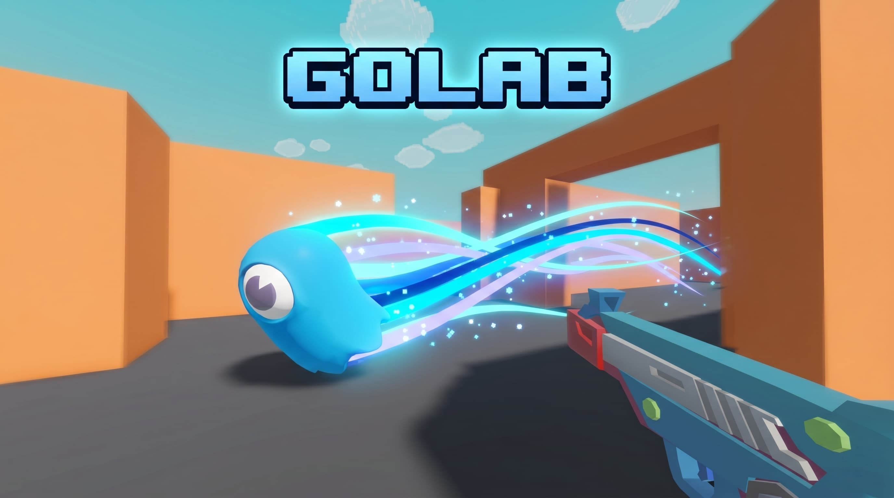

# 🌹 Golab


**Golab** is a goofy, cartoonish, open-source multiplayer shooter written in Rust with Bevy — where everything is round, soft, blobby. 🔫🫧🌹

The name comes from a silly little chain of thoughts:

> Everything looks like a **blob** → blob sounds like **Golab** → Golab brings Persian rose water vibes → boom, tiny chaotic **Golab** shooter. 🌹✨



<details>
  <summary>🎬 Click to watch the gameplay clip</summary>

  <br>

  <video src="assets/Github/gameplay.mp4" controls poster="assets/Github/preview.jpg" width="100%">
    Your browser does not support the video tag. You can watch the gameplay clip here: <a href="assets/Github/gameplay.mp4">gameplay.mp4</a>
  </video>
</details>

---

## ✨ What is this?

Golab is a fast little arena shooter with squishy cartoon energy:

- 🫧 **Blob-like characters** with cute low-poly/cartoon styling
- 🔫 **First-person shooting** with tiny glowing red blob bullets
- 🏃 **Movement tech**: jump, crouch, dash, and zip around the arena
- 👀 **First-person / third-person toggle** for maximum blob appreciation
- 🌐 **Multiplayer client + dedicated server** powered by Lightyear
- ❤️ **Health, respawn, ping, name tags, and HUD indicators**
- ⚙️ **In-game settings** for mouse sensitivity, audio, graphics, shadows, AA, motion blur, and more
- 🦀 **Built in Rust** because fearless concurrency pairs nicely with fearless blobbery

---

## 🎮 Controls

| Action | Input |
| --- | --- |
| Move | `W` `A` `S` `D` |
| Look around | Mouse |
| Shoot | Left mouse button |
| Dash | Right mouse button |
| Jump | `Space` |
| Crouch | `Left Ctrl` / `Right Ctrl` |
| Toggle first/third person | `R` |
| Open menu | `Esc` |
| Switch join fields | `Tab` |

---

## 🚀 Quick start

### Prerequisites

- 🦀 Rust with the repository toolchain installed — this project uses `nightly`
- 🎮 A graphics-capable machine supported by Bevy/wgpu

Clone the garden:

```bash
git clone https://github.com/NiiightmareXD/golab.git
cd golab
```

### Offline blob mode

Want to just vibe, run around, and test the game without a server? Launch the client by itself:

```bash
cargo run -p client --release
```

You can play offline locally — the server is only needed when you want multiplayer blob chaos. 🫧

### Multiplayer blob mode

#### 1. Start the server

```bash
cargo run -p server --release
```

The default server address is:

```text
127.0.0.1:5000
```

Want to bind the server somewhere else, like `0.0.0.0:5000` for LAN/external connections? Change `SERVER_ADDR` in `shared/src/lib.rs`:

```rust
pub const SERVER_ADDR: SocketAddr = SocketAddr::new(IpAddr::V4(Ipv4Addr::UNSPECIFIED), 5000);
```

> When binding to `0.0.0.0`, remote clients should join using the host machine's LAN/public IP address, not `0.0.0.0` itself.

#### 2. Start the client

In another terminal:

```bash
cargo run -p client --release
```

Open the menu, join the server, choose your blob name, and enter arena. 🌹🫡

> Tip: run multiple clients locally if you want to test multiplayer chaos on one machine.

---

## 🧰 Tech stack

| Piece | Tech |
| --- | --- |
| Engine | [Bevy](https://bevyengine.org/) |
| Physics / collision | [Avian3D](https://github.com/Jondolf/avian) |
| Networking | [Lightyear](https://github.com/cBournhonesque/lightyear) |
| Language | Rust 2024 / nightly |
| License | MIT |

---

## 📁 Project layout

```text
golab/
├── assets/          # Models, sounds, textures, environment maps, GitHub media
├── client/          # Bevy game client
├── server/          # Dedicated multiplayer server
├── shared/          # Shared protocol, messages, constants
├── Cargo.toml       # Workspace config
└── README.md        # You are here 🌹
```

---

## 🌱 Contributing

Pull requests, issues, ideas, bug reports, balancing suggestions, and ridiculous blob-related feature requests are welcome.

If you want to help, good places to start are:

- 🐛 report bugs
- 🎨 improve assets or animations
- 🔊 add satisfying blob sounds
- 🕹️ tune gameplay feel
- 🌐 improve networking polish
- 📚 improve docs

---

## 🥤 ~~Buy me a coffee~~ Buy me Claude Code

If Golab made you smile, helped you learn, or gave you the sudden urge to duel cartoon blobs, you can support the project here:

[](https://github.com/sponsors/NiiightmareXD)

Every little bit helps fuel more Rust, more Bevy, more blob polish, and probably more **Claude Code credits** instead of coffee. 🤖💸🌹

---

## 📜 License

Golab is released under the [MIT License](LICENSE).

---

<p align="center">
  Made with 🦀 Rust
</p>
